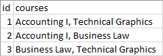
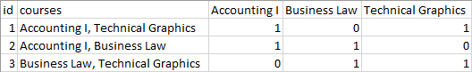

# List to True/False Values

Looks at specific columns inside a CSV file which contain a comma-separated list. Splits that list
into new headers in the file. Then processes each row. If the column inside that row contains the
header, a 1 (true) is entered, otherwise a 0 (false) is entered.

Transform this



into this



## Installation

```
> git clone https://github.com/travishorn/list-truefalse-value
```

## Usage

```
> node index <filename> <columns>
```

`<columns>` is zero-indexed. For example, the following will process the second and third columns
in myfile.csv

```
> node index myfile.csv 1 2
```
